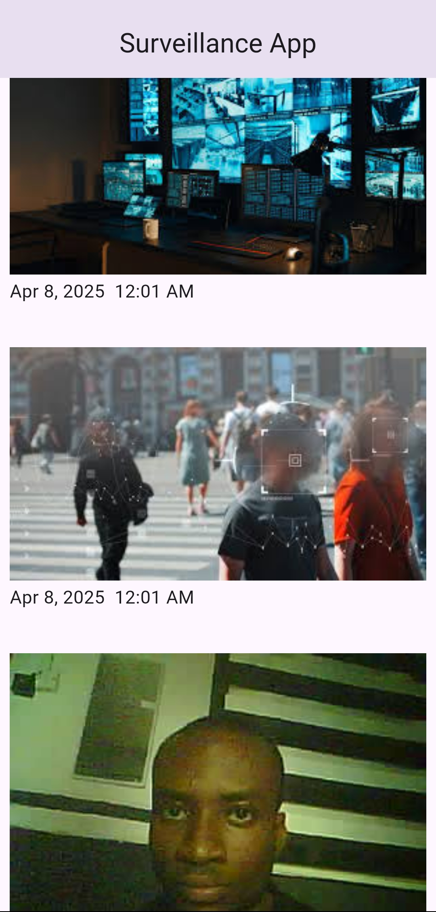

# 📸 ESP32Cam-Flutter Image Transmission

Academic Project by Adedoyin Kabir and Olubosede Olumide

## Description

A system that captures images via ESP32-CAM and transmits them to a Flutter mobile app through Firebase Real-Time Database for real-time viewing and storage.
This repo is for the mobile app side of the project.

## 🌟 Features

1. ESP32-CAM: Captures images, converts the image to base64, and streams them over Wi-Fi.
2. Firebase Realtime Database: Stores the received base64 image, stores it and sends it to the mobile app in real time.
3. Flutter App: Displays received images in real-time with a responsive UI.
4. Storage: Saves images locally on the mobile device with hive_flutter.

## Screenshots

## 🛠️ Tech Stack

1. Hardware: ESP32-CAM (OV2640 camera module).
2. Firmware: Arduino/C++ (ESP32 SDK).
3. Backend: Firebase Realtime Database for cloud storage.
4. Mobile App: Flutter (Dart) with http/websocket for communication.

## Contributing
We welcome contributions from anyone. To contribute to the project, please follow these steps:
- 🍴 Fork the repository.
- 🌿 Create a branch for your feature/fix.
- 💻 Commit changes with clear messages.
- 🔄 Push to your fork.
- ✨ Open a PR targeting the main branch.
